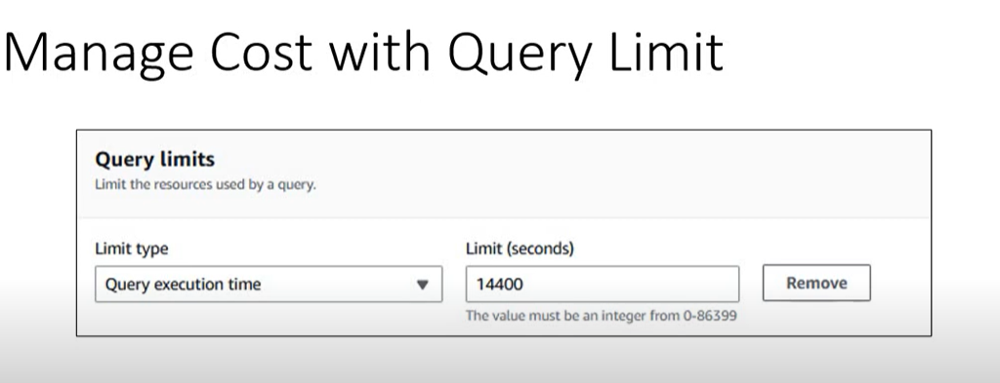
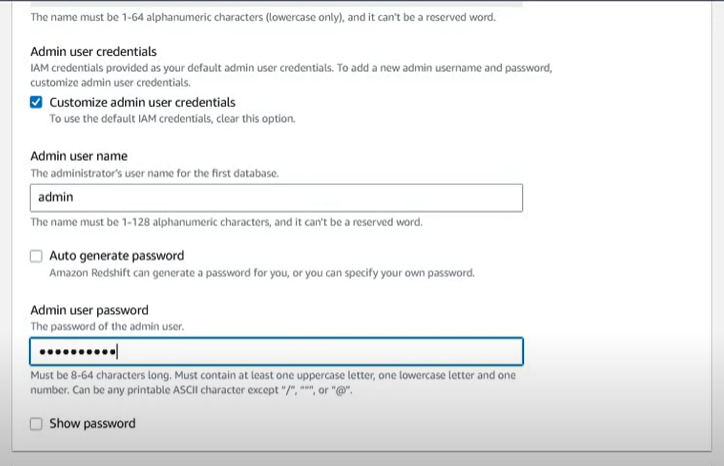
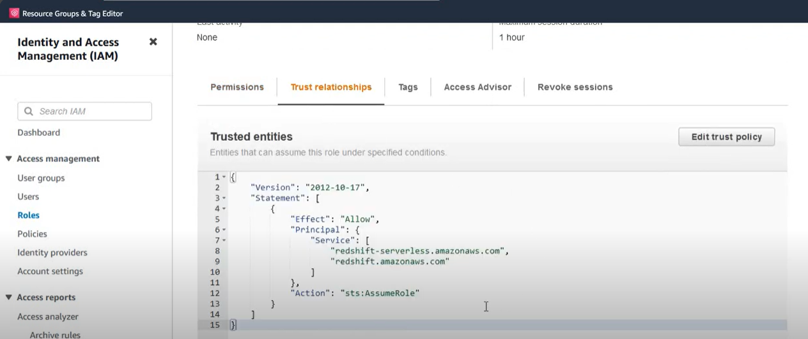
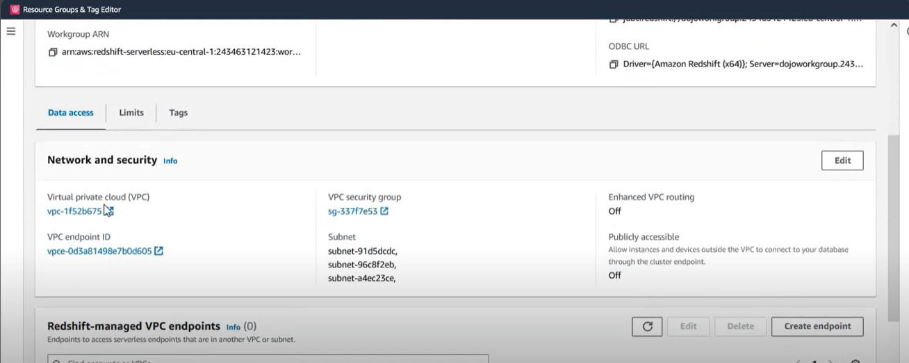

Sure! Here's a detailed and well-structured explanation of **Amazon Redshift Serverless** based on the provided transcript:

---

## **Introduction to Amazon Redshift Serverless**

Amazon Redshift Serverless is a **fully managed serverless data warehouse** solution provided by AWS. It enables users to run and scale analytics without having to provision or manage infrastructure. Unlike the traditional provisioned Redshift clusters, with Redshift Serverless, users can run complex analytical queries and gain insights using standard SQL without setting up or maintaining clusters or instances.

---

## **Key Components**

When provisioning Amazon Redshift Serverless, there are two essential components to configure:


### 1. **Namespace**
- **Purpose**: Used for managing **database objects**.
- **Includes**: Databases, schemas, tables, views, stored procedures, users, groups, etc.
- Think of it as the **logical layer** where your data resides.

### 2. **Workgroup**
- **Purpose**: Defines the **compute configuration** for the data warehouse.
- **Includes**: The compute capacity that is allocated for query processing.
- **Note**: Users specify the required compute resources, but AWS manages and provisions the infrastructure dynamically.

### One-to-One Mapping:
- Each **namespace** is paired with exactly **one workgroup**, and vice versa.
- They form a tight coupling necessary to operate the serverless data warehouse.

---

## **Endpoint Configuration**

- The endpoint of a Redshift Serverless instance is **similar** to a provisioned Redshift cluster.
- **Key Differences**:
  - Instead of a cluster name, the **workgroup name** is used.
  - The endpoint reflects **Redshift Serverless** rather than the classic Redshift cluster.

---

## **Compute Capacity**

### Measured in **RPUs** (Redshift Processing Units):
- This is the unit of compute capacity in Redshift Serverless.
- Unfortunately, there’s **no official documentation** that equates 1 RPU to a specific number of vCPUs or GB of memory.

### **Base Capacity**:
- Refers to the **minimum number of RPUs** allocated per query.
- For example, if base capacity is set to 128 RPUs, then each query will use **at least** 128 RPUs.
- Redshift can automatically **scale beyond the base capacity** if the query needs more compute power.

### **How to Choose Base Capacity**:
- There is **no fixed benchmark** for choosing the base capacity.
- Query performance depends on:
  - Query complexity (joins, aggregations, etc.)
  - Table design
  - Data volume
- Recommended approach:
  - **Experiment with different base capacities** (32, 64, 128, 256, etc.)
  - Monitor query performance
  - Choose the **minimum RPU** that provides acceptable performance

### **Dynamic Scaling**:
- You can adjust your base capacity at any time with minimal delay (seconds to minutes).
- Valid range: **32 to 512 RPUs**
- Changes happen in **increments of 8 RPUs** (e.g., 32, 40, 48, ..., 512)

---

## **Cost Calculation**

### Redshift Serverless pricing is based on **RPU-hours**:
- Cost = **(Number of RPUs × Query Duration in seconds) ÷ 3600**
- Then multiply by the **per-hour cost** of RPU (e.g., in Ireland: **$0.387 per RPU-hour**)

#### Example Calculation:
If a query uses `Y` RPUs and runs for `Z` seconds:
```
RPU Hours = (Y * Z) / 3600
Cost = RPU Hours * $0.387 (in Ireland)
```

### Behavior of Base Capacity:
- Base capacity is the **minimum** compute allocated per query.
- If the query needs more compute, Redshift **automatically scales up** beyond the base capacity.

---

## **Serverless Advantage – Cost Efficiency**


- In **provisioned Redshift**, you must **pause** or **terminate** clusters to save costs.
- With **Redshift Serverless**:
  - If **no queries are running**, **you don’t pay anything**.
  - It’s inherently **cost-efficient** for intermittent workloads.

---

## **Important Notes on Query Types**

- All query types **incur charges**:
  - **Internal queries**: Accessing Redshift-managed database objects.
  - **External queries**: Accessing data stored in external schemas (e.g., Amazon S3).
- If **no queries are executed**, **you are not charged**—even though the serverless instance is "active".

---

## **Conclusion**

Amazon Redshift Serverless simplifies data warehousing by:
- Removing infrastructure management overhead.
- Offering **elastic scaling** and **cost-efficiency**.
- Allowing users to experiment and optimize for performance and cost by tuning RPU base capacity.

It’s a powerful solution for teams that need flexibility, scalability, and minimal operational complexity while running analytical workloads on AWS.

Sure! Here’s a **detailed and organized breakdown** of the topics discussed in the transcript regarding **Amazon Redshift Serverless**, focusing on **costs, usage limits, storage, connectivity, and migration**:

---

## 🧮 **Cost of Running a Data Warehouse in Redshift Serverless**

### **1. Multiple Users and Concurrent Queries**
- In real-world usage, multiple users (e.g., 50 or 100 users) may run queries **simultaneously**.
- Each query:
  - Consumes its own amount of **Redshift Processing Units (RPUs)**.
  - Runs for its own **execution time**.
- Queries can be:
  - **Sequential**: One after the other.
  - **Parallel**: Multiple queries at the same time.

### **2. Cost Calculation**

- For each query:
  ```
  Cost = (RPUs used × Runtime in seconds) / 3600 × RPU hourly rate
  ```
- For Ireland region:
  - **1 RPU-hour = $0.387**
- The total cost of the data warehouse is the **sum of all query costs**—whether parallel or sequential.

---

## 🔒 **Managing and Controlling Costs**

### **A. Usage Limits**
To prevent unexpected cost spikes, you can configure **usage limits** for RPU-hours:


- **Time-based limits**:
  - **Daily**
  - **Weekly**
  - **Monthly**

Example configuration:
- Daily: 100 RPU-hours
- Weekly: 650 RPU-hours
- Monthly: 20,000 RPU-hours

### **B. Actions When Usage Limits Are Hit**
You can configure the system to take one of the following actions:

1. **Alert**:
   - Send a notification (e.g., using Amazon SNS) when a limit is breached.

2. **Log Only**:
   - Log the event in a system table for auditing/reporting.

3. **Stop Queries**:
   - Prevent any new queries from running once the usage limit is reached.

> ✅ This ensures your Redshift Serverless environment stays within your **budget boundaries**.

---

## ⏱️ **Query Limits**



### **Why Use Query Limits?**
- To prevent a **badly designed query** from consuming excessive compute resources and driving up costs.

### **Types of Query Limits**:
1. **Query Execution Time**:
   - Set a maximum duration for queries (e.g., 5 minutes). If a query exceeds this, it’s automatically stopped.

2. **Other Limits**:
   - Limits can also be applied to:
     - **CPU usage**
     - **Memory consumption**
   - These help optimize both cost and system performance.

> ⚠️ **Important**: Use these as **safety nets**, not as strict cost-control mechanisms. Some valid, complex queries may require longer runtimes or more resources.

---

## 💾 **Storage Cost and Configuration**


### **No Manual Storage Provisioning Needed**
- Unlike traditional Redshift clusters, **Redshift Serverless handles storage automatically**.
- Storage scales **up or down** depending on data volume.

### **Storage Type**:  
- Uses **Redshift Managed Storage (RMS)**, originally introduced with RA3 clusters.

### **Pricing**:
- **$0.024 per GB per month**

### **Snapshot & Backup**:
- Backup and snapshot functionality is similar to provisioned Redshift.
- Billed separately, using the same billing model as traditional clusters.

> 🛠️ You **do not need to configure** or manage storage explicitly in Redshift Serverless.

---

## 🔌 **Connecting to Redshift Serverless**


Redshift Serverless supports the same connectivity options as traditional Redshift:

- **JDBC/ODBC drivers**
- **Redshift Data API**
- **VPC Endpoints**:
  - For private access within your Virtual Private Cloud (VPC)

### **Endpoint Format**:
- Same as provisioned clusters, with two key differences:
  - Uses **workgroup name** instead of cluster name.
  - Endpoint reflects **Redshift Serverless**, not classic Redshift.

---

## 🔁 **Migration from Provisioned Clusters**


If you're running an existing Redshift cluster (DC2, DS2, RA3), migrating to serverless is simple:

### **Steps to Migrate**:
1. **Take a Snapshot** of your existing provisioned cluster.
2. **Restore** from the snapshot to create a **Redshift Serverless namespace**.

> 🔄 This is similar to migrating between two provisioned Redshift clusters.

---

## ✅ **Summary**

| **Aspect**               | **Details**                                                                 |
|--------------------------|-----------------------------------------------------------------------------|
| **Compute Cost**         | Based on RPU usage × execution time × hourly RPU rate                      |
| **Storage Cost**         | $0.024/GB/month using Redshift Managed Storage                             |
| **Cost Controls**        | Usage Limits (daily/weekly/monthly), Query Limits                          |
| **Connection Methods**   | JDBC/ODBC, Data API, VPC Endpoints                                          |
| **Migration Process**    | Snapshot existing cluster → Restore to serverless namespace                |
| **Auto-scaling**         | Both compute (RPUs) and storage scale dynamically                          |
| **Idle Cost**            | $0 cost if no queries are being executed                                   |

---


## **IAM Role in Redshift Serverless**

### **Assigning IAM Role**
- **IAM Role**: In Amazon Redshift, you can assign an **IAM role** to provide the cluster with access to other AWS services (e.g., **S3**, **Glue Catalog**, **SageMaker**).
- This applies both to **Redshift provisioned clusters** and **Redshift Serverless**.
  
### **Difference for Redshift Serverless**:


- **Trust Relationship**: For **Redshift Serverless**, you need to add an additional trust relationship to the IAM role.
  - The trust relationship for Redshift Serverless is:
    ```
    redshift-serverless.amazonaws.com
    ```
- In contrast, for regular Redshift clusters, the trust is typically with:
    ```
    redshift.amazonaws.com
    ```
  - This is the only difference when assigning an IAM role to Redshift Serverless.

---

## **Key Features of Amazon Redshift Serverless**

Amazon Redshift Serverless offers several **features** that align with the capabilities of **provisioned Redshift clusters** (DC, DS, RA3):


### **1. Snapshotting**
   - Ability to take snapshots of your data, ensuring you can restore it if needed.

### **2. UDFs and Procedures**
   - Support for **User-Defined Functions (UDFs)** and **stored procedures** to extend the functionality of your queries.

### **3. Materialized Views**
   - Redshift Serverless supports **materialized views**, allowing you to store the result of a query for faster access.

### **4. Federated Query**
   - Use **Federated Query** to query data across different sources (e.g., querying external databases like RDS or Aurora directly from Redshift).

### **5. Data Sharing**
   - Redshift Serverless also allows **data sharing** across multiple Redshift clusters, which is useful for cross-region data sharing or collaboration between different accounts.

### **6. Running Machine Learning Models**
   - You can run **machine learning models** (like classification or regression models) directly from within Redshift, integrating with **SageMaker** or using built-in ML functionality.

### **7. Extending to Data Lakes**
   - You can integrate Redshift Serverless with **data lakes**, making it easier to query and analyze vast amounts of unstructured data.

---

## **Demo Overview: Setting Up Redshift Serverless**

### **Steps to Set Up and Configure Redshift Serverless**

1. **Create a Workgroup**:
    
    
    
   - Go to the Redshift console and create a **workgroup**. This is where you define the **base capacity** (in RPUs) for your Redshift serverless cluster.
   
   - Example: Set the **base capacity** to **40**.
    


2. **Create a Namespace**:
    
   - A **namespace** in Redshift is where you define your **databases** and **tables**.
    
   - For the demo, a **namespace** called **"demo namespace"** was created with a login name and password.
   
   

3. **Assign IAM Role**:
    
    
   - You assign an **IAM role** to your Redshift Serverless namespace to allow it access to other AWS services (like S3, Glue, etc.).
    
    
   - Ensure that the IAM role has the proper **trust relationship** configured for Redshift Serverless (`redshift-serverless.amazonaws.com`).
   


4. **Configure Encryption and Logging**:
    
   - Enable **encrypted logging** to enhance security and data privacy.

5. **Set Up Usage and Query Limits**:
    
    
    
    
    
    
   - Configure **usage limits** (e.g., daily, weekly, monthly limits) to manage the cost effectively.
   
   
   
   - Set **query limits** to control things like **CPU usage**, **memory usage**, **query execution time**, etc.

---

### **Managing and Modifying Workgroup Settings**

- **Modify Workgroup Capacity**:
  - You can **adjust the capacity** of your Redshift Serverless cluster at any time (e.g., change the RPU value).
  - Note: **Capacity changes** only occur in increments of **8 RPUs**.

- **Set Usage Limits**:
  - You can configure **daily**, **weekly**, and **monthly usage limits**.
  - Alerts can be triggered when limits are exceeded, with options to stop queries if needed.

- **Query Limits**:
  - Configure query-related limits like **query CPU time**, **memory usage**, and **row count** to optimize performance and cost.

---

### **Demo Steps**
1. **Creating Work Group and Namespace**:
   - In the AWS Console, navigate to the Redshift Serverless dashboard.
   - The process starts with creating a **Work Group**, where you specify the capacity of your Redshift warehouse (e.g., a base capacity of 40).
   - After that, you create a **Namespace**, which is where databases and tables are configured.
   - You provide necessary credentials, such as the **admin username** and **password**.
   - The **IAM role** is assigned here, and it is crucial to ensure that the trust relationship for **Redshift Serverless** is properly configured. 
   - Encryption for logging can also be set up.

2. **Configuring Cluster**:
   - Once the workgroup is set up, you can configure various aspects of the cluster like **backup settings**, **security**, and **data sharing**.
   - The IAM role is attached to the namespace, ensuring that the right permissions are in place for accessing other AWS services.

3. **Cluster Creation**:
   - Once the workgroup and namespace are created, the cluster starts to form.
   - There is an option to change the base capacity if needed, and this can be done at any time.

4. **Managing Limits**:
   - You can configure several types of limits for the serverless cluster:
     - **Query limits** (e.g., CPU time, block reads, etc.)
     - **Usage limits** (daily, weekly, monthly quotas for resource consumption)
     - **RPU (Redshift Processing Unit) limits** can also be adjusted.

5. **Querying Data**:
   - A query editor is available for running queries directly on the Redshift Serverless cluster.
   - The **query editor** provides the same functionality as the traditional Redshift clusters, where you can create tables, insert data, and query it.
   - The performance is typically faster after the first query since the cluster is already running in the background.

6. **Capacity and Cost Management**:
   - Redshift Serverless enables fine-grained control over the **capacity** and **usage limits**, ensuring you can manage costs effectively.
   - The cost is tied to the amount of resources (like RPUs) consumed, so configuring proper limits is crucial to controlling your expenses.

### **Key Points about Redshift Serverless**
- Redshift Serverless provides a highly flexible and scalable solution for running analytical workloads without the need to manage infrastructure.
- Features such as **snapshotting, federated queries, machine learning integration, and materialized views** are all available on Redshift Serverless.
- Capacity management and usage limits are vital in controlling costs and ensuring resources are efficiently allocated.
- The setup process involves configuring IAM roles, namespaces, workgroups, and proper trust relationships for seamless access to AWS services like S3, Glue, and SageMaker.

## **Conclusion**

### **Key Takeaways**:
1. **Redshift Serverless** provides features similar to **provisioned Redshift clusters** (DC, DS, RA3) with easy management and auto-scaling.
2. **IAM roles** and **trust relationships** are essential for integrating with other AWS services (e.g., S3, Glue, SageMaker).
3. **Capacity** and **usage limits** can be configured to **control costs**.
4. The **query editor** in Redshift Serverless behaves similarly to the non-serverless version, making it easy to transition.
5. Redshift Serverless is a great solution for users looking for a **fully managed, auto-scaling** data warehouse without the need for manual capacity management.


