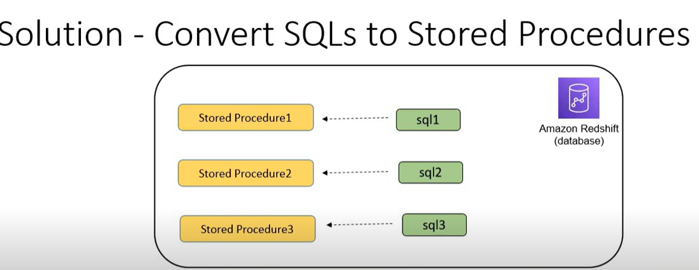
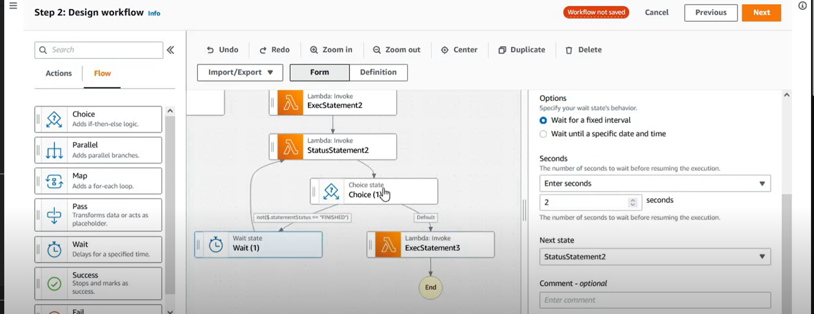
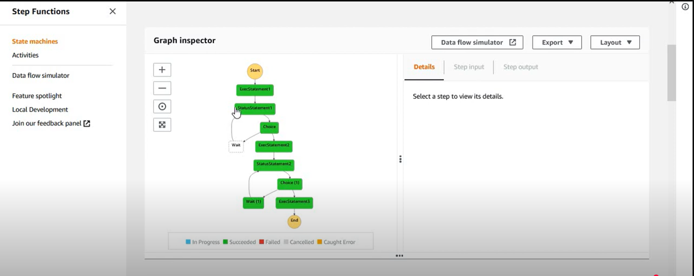

---

# **Comprehensive Guide to Orchestrating Redshift SQL Queries with AWS Step Functions and Lambda**


This guide provides a comprehensive, step-by-step tutorial for orchestrating SQL queries in Amazon Redshift using AWS Step Functions and AWS Lambda. The solution leverages AWS Lambda for running SQL queries on Redshift asynchronously, while AWS Step Functions coordinate the execution of these queries, enabling advanced workflows such as sequential and parallel executions.

### **Understanding the Problem**


There are scenarios where you need to execute multiple SQL statements on a Redshift database in a specific order. For example:
- Executing a series of SQL commands in sequence.
- Running some SQL commands in parallel.
- Handling complex workflows that require conditional execution (e.g., executing SQL 4 only after SQL 2 and SQL 3 finish).

The traditional solution would be to use **Stored Procedures** to sequence SQL statements. However, stored procedures have limitations:
- They can't handle complex workflows that involve parallel executions.
- They don't integrate easily with event-driven triggers or scheduling.
- Therefore, for more advanced orchestration (e.g., event-based or complex scheduling), stored procedures are not sufficient.

In this guide, we’ll go through the following sections:
- Overview of AWS Lambda and Step Functions for SQL orchestration.
- Step-by-step setup for the Lambda functions.
- AWS Step Functions workflow to manage the orchestration.
- Best practices for maintaining and optimizing this solution.

---

### **Step Functions and Lambda as a Solution**
To address these limitations, **AWS Step Functions** can be used in conjunction with **AWS Lambda** to orchestrate Redshift SQL queries. The solution leverages the following AWS services:
- **AWS Lambda**: A serverless compute service that can execute functions like running Redshift queries using the Redshift Data API.
- **Redshift Data API**: This API enables interaction with Redshift without requiring an active connection to the database.
- **AWS Step Functions**: A service that allows users to coordinate Lambda functions and other AWS services into serverless workflows.

#### **Two Key Approaches**
1. **Lambda with Redshift Data API**:
   - Lambda functions execute SQL queries by using the Redshift Data API.
   - Each SQL statement is executed asynchronously, allowing the next function to run without waiting for the current query to complete.

2. **Direct Step Function Tasks with Redshift Data API**:
   - AWS Step Functions provides a native task for calling Redshift Data API.
   - This option runs SQL queries in an asynchronous manner (similar to Lambda) and would be useful for simpler workflows.

The speaker emphasizes that while Step Functions can directly call the Data API, using **Lambda functions** is the recommended solution for greater control and flexibility, particularly for synchronous workflows.

---

## **Chapter 1: Setting Up AWS Lambda Functions**

### **1.1 Purpose of Lambda Functions**
#### **Advantages of Using Lambda Functions**:
- **Readability and Maintainability**: Storing SQL statements as stored procedures makes the orchestration more readable and easier to maintain, especially when dealing with complex multi-line SQL queries.
- **Performance**: Stored procedures in Redshift offer better performance over regular SQL statements due to optimization within Redshift.


There are two Lambda functions that make up the core of this orchestration:
1. **Lambda 1**: Executes the SQL query or stored procedure on Redshift.
2. **Lambda 2**: Checks the execution status of the SQL query to determine whether it has completed, failed, or is still running.

These Lambda functions communicate with the Redshift Data API to interact with the Redshift cluster, manage execution, and retrieve statuses.

### **1.2 Lambda 1: Execute SQL Statement**

This Lambda function triggers the execution of a SQL statement using the Redshift Data API.


```python
import boto3
import json

def lambda_handler(event, context):
    # Connect to Redshift client
    client = boto3.client('redshift-data')

    # Extract the SQL statement from the event
    sql = event['sql_statement']

    # Execute the SQL statement
    response = client.execute_statement(
        ClusterIdentifier='<redshift-cluster-id>',
        Database='<database-name>',
        SecretArn='<secret-arn>',
        Sql=sql
    )

    return {
        'statusCode': 200,
        'body': json.dumps({
            'StatementId': response['Id']
        })
    }
```

### **1.3 Lambda 2: Check Status of SQL Execution**

This Lambda function checks the status of the SQL query execution to determine whether it is complete.

```python
import boto3
import json

def lambda_handler(event, context):
    # Connect to Redshift client
    client = boto3.client('redshift-data')

    # Get the statement ID from the event
    statement_id = event['StatementId']

    # Describe the statement to get the status
    response = client.describe_statement(
        Id=statement_id
    )

    # Extract the execution status
    statement_status = response['Status']

    return {
        'statusCode': 200,
        'body': json.dumps({
            'StatementStatus': statement_status
        })
    }
```
#### **2. Lambda Function to Check the Status of the SQL Execution**


This Lambda function checks the execution status of a SQL statement:
- It uses the **DescribeStatement** method from the Redshift Data API to retrieve the status of the SQL query.
- It checks if the statement has finished executing or is still running.

Here’s the example Python code:
```python
import boto3

# Create Redshift Data client
redshift_client = boto3.client('redshift-data')

# Get status of SQL execution
response = redshift_client.describe_statement(
    Id='your-statement-id'
)

status = response['Status']
```
- The status can be `FINISHED`, `PENDING`, `STARTED`, `FAILED`, etc.
- The business logic checks if the status is `FINISHED`, then moves to the next SQL statement. If not, it waits and rechecks after a set interval.

---
### **Workflow Logic and Orchestration**
The orchestrated workflow is designed using AWS Step Functions:
1. **Execute SQL**: Trigger the first Lambda function to run the SQL statement.
2. **Check Status**: Trigger the second Lambda function to check the execution status.
3. **Decision Logic**: Based on the status returned, decide whether to proceed with the next statement or wait. If the statement hasn't finished, the workflow waits and checks again.
4. **Sequencing and Parallel Execution**: You can sequence the SQL executions linearly or run them in parallel, depending on the dependencies.

For example:
- **Linear Execution**: SQL 2 will only run after SQL 1 finishes, and SQL 3 will only run after SQL 2 finishes.
- **Parallel Execution**: SQL 2 and SQL 3 can start at the same time, but SQL 4 will wait until both finish.

---

### **Handling Complex Workflows**
- AWS Step Functions allows complex workflows where you can have a combination of:
  - **Sequential execution** (SQL 1 -> SQL 2 -> SQL 3).
  - **Parallel execution** (SQL 2 and SQL 3 running simultaneously).
  - **Wait and retry logic** using decision states.

You can control whether to wait for one SQL query to finish before moving on to the next or allow multiple SQL queries to execute in parallel.


### **Best Practices and Recommendations**
- **Use Stored Procedures**: Convert large and complex SQL statements into stored procedures for better performance, readability, and maintainability.
- **Environment Variables**: For Lambda functions, avoid hardcoding sensitive values (like database credentials or cluster IDs). Instead, use environment variables or AWS Secrets Manager to securely manage credentials.
- **Asynchronous Execution**: Remember that SQL executions via the Lambda function are asynchronous, and you need a mechanism (like the status Lambda) to track when a statement finishes.
- **Mix-and-Match Workflows**: You can mix sequential and paralflel executions based on the needs of your application, using Step Functions to manage this flow effectively.

---

## **Chapter 2: Setting Up Redshift**

### **2.1 Redshift Cluster Configuration**

To use Redshift with AWS Lambda and Step Functions, you must have a Redshift cluster. Ensure your Redshift database contains the required tables for the workflow.


### **2.2 SQL Stored Procedures**

Create SQL stored procedures in Redshift that can be invoked via the Lambda functions. Each stored procedure should perform specific operations like populating summary tables.

Example stored procedures:
- **Fill Order Summary**: Aggregates order amounts.
- **Fill Product Summary**: Aggregates product sales data.
- **Fill Product Quantity Summary**: Aggregates product quantities.

---


### **3.2 Workflow Design**

The workflow involves the following steps:
1. **Execute SQL Statement 1**: Trigger the first Lambda function to execute the first SQL statement.
2. **Check SQL Status**: Trigger Lambda 2 to check if the SQL execution is finished.
3. **Wait or Proceed**: If the execution is not finished, the workflow waits and checks again after a set time.
4. **Execute SQL Statement 2**: Once Statement 1 is finished, proceed to the next SQL statement.
5. **Repeat for SQL Statements 2 and 3**: Continue checking each statement’s status and executing the next one sequentially.
6. **End Workflow**: When all SQL statements are executed, end the workflow.

### **3.3 Step Functions State Machine JSON**

Here is an example JSON configuration for Step Functions to orchestrate the SQL executions.






```json
{
  "StartAt": "Execute Statement 1",
  "States": {
    "Execute Statement 1": {
      "Type": "Task",
      "Resource": "arn:aws:lambda:region:account-id:function:execute-stored-procedure",
      "ResultPath": "$.statement1",
      "Next": "Check Status of Statement 1"
    },
    "Check Status of Statement 1": {
      "Type": "Task",
      "Resource": "arn:aws:lambda:region:account-id:function:get-status",
      "ResultPath": "$.status1",
      "Next": "Is Statement 1 Finished?"
    },
    "Is Statement 1 Finished?": {
      "Type": "Choice",
      "Choices": [
        {
          "Variable": "$.status1.StatementStatus",
          "StringEquals": "Finished",
          "Next": "Execute Statement 2"
        }
      ],
      "Default": "Wait"
    },
    "Wait": {
      "Type": "Wait",
      "Seconds": 2,
      "Next": "Check Status of Statement 1"
    },
    "Execute Statement 2": {
      "Type": "Task",
      "Resource": "arn:aws:lambda:region:account-id:function:execute-stored-procedure",
      "ResultPath": "$.statement2",
      "Next": "Check Status of Statement 2"
    },
    "Check Status of Statement 2": {
      "Type": "Task",
      "Resource": "arn:aws:lambda:region:account-id:function:get-status",
      "ResultPath": "$.status2",
      "Next": "Is Statement 2 Finished?"
    },
    "Is Statement 2 Finished?": {
      "Type": "Choice",
      "Choices": [
        {
          "Variable": "$.status2.StatementStatus",
          "StringEquals": "Finished",
          "Next": "Execute Statement 3"
        }
      ],
      "Default": "Wait"
    },
    "Execute Statement 3": {
      "Type": "Task",
      "Resource": "arn:aws:lambda:region:account-id:function:execute-stored-procedure",
      "ResultPath": "$.statement3",
      "End": true
    }
  }
}
```

### **3.4 Workflow Execution**

The workflow is triggered by initiating the Step Functions state machine. The steps are executed sequentially or in parallel based on the configured logic. If the status check fails (SQL query not finished), the workflow waits and retries.

---

## **Chapter 4: Best Practices and Recommendations**

### **4.1 Use Stored Procedures**

Stored procedures in Redshift provide better performance for complex SQL queries. Instead of running long SQL statements directly, encapsulate them in stored procedures for improved maintainability and performance.

### **4.2 Avoid Hardcoding Sensitive Data**

Use environment variables and AWS Secrets Manager to store sensitive data like database credentials and cluster identifiers securely.

### **4.3 Implement Asynchronous Execution**

Lambda functions in this setup are asynchronous. Ensure you handle the execution flow properly by monitoring the SQL execution status, using a retry mechanism for status checks.

### **4.4 Combine Sequential and Parallel Execution**

You can design workflows to execute SQL queries either sequentially or in parallel, depending on the interdependencies between queries.

---

## **Chapter 5: Testing and Monitoring the Workflow**

### **5.1 Monitoring Lambda Functions**

Lambda functions can be monitored using CloudWatch Logs. Ensure you log sufficient information to troubleshoot any issues with SQL executions or status checks.

### **5.2 Verifying Redshift Updates**

After executing the workflow, check the Redshift tables to confirm that the operations (like populating summary tables) have been successfully performed.

### **5.3 Step Functions Execution Logs**

You can monitor the workflow execution status through Step Functions’ built-in logging and error handling features. This provides visibility into the success or failure of each step.

---

## **Conclusion**

This guide covered the process of orchestrating SQL queries in Amazon Redshift using AWS Lambda and Step Functions. You’ve learned how to:
- Set up Lambda functions to execute SQL statements and check their statuses.
- Design a Step Functions state machine to manage SQL executions in a reliable workflow.
- Monitor and test the workflow execution.

By following this guide, you can automate and manage complex data workflows with minimal coding while ensuring scalability and fault tolerance in your data pipelines.


---
