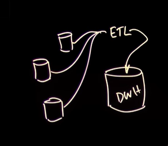
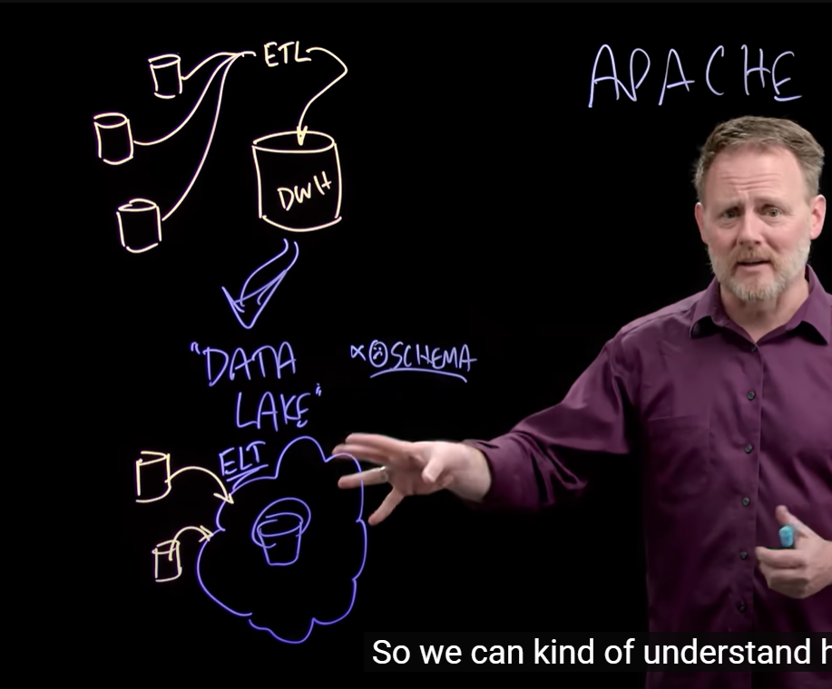
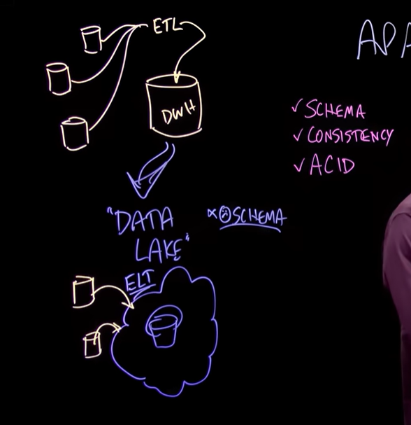
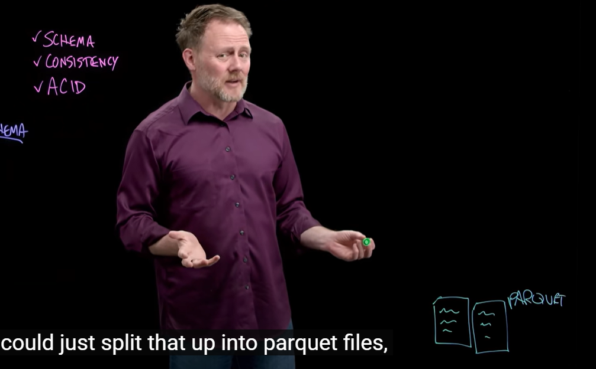
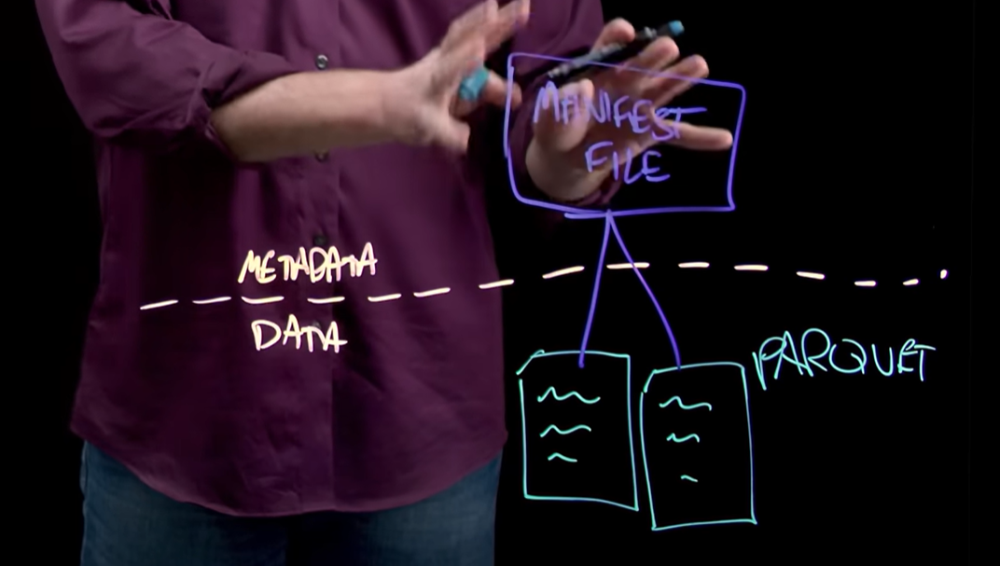
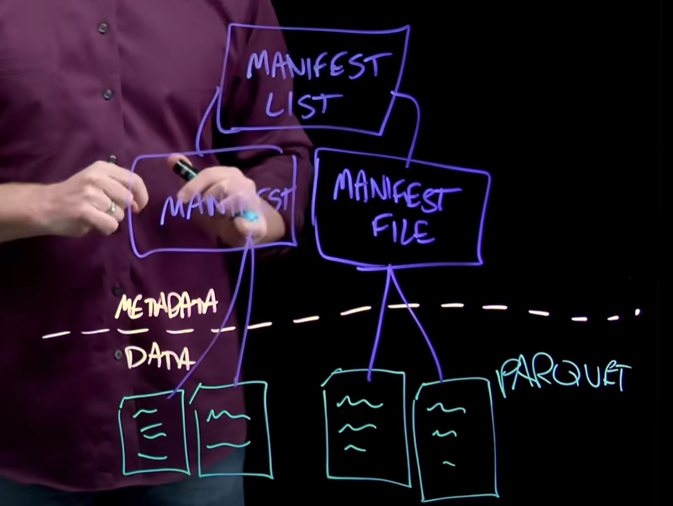
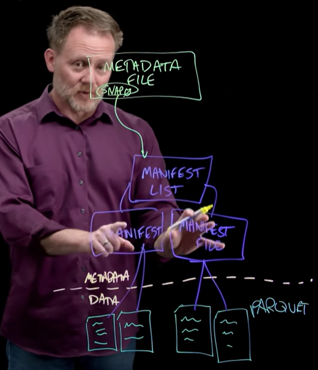
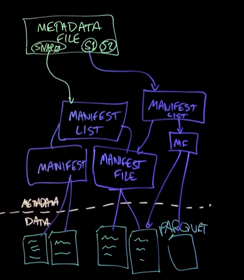
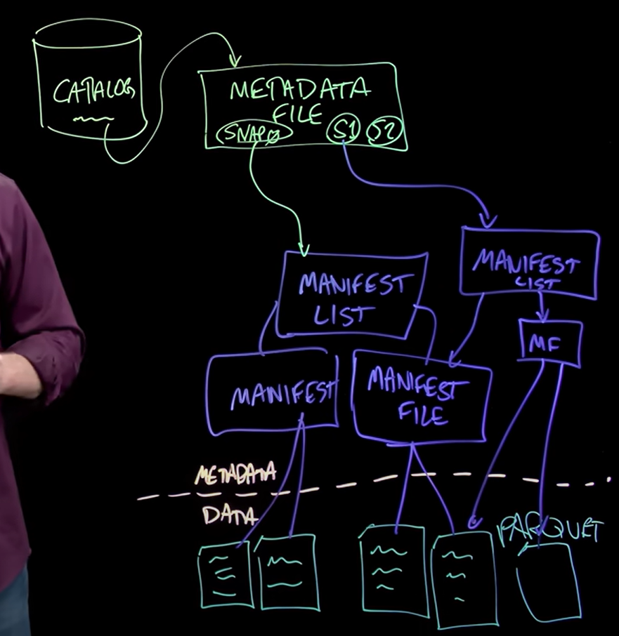
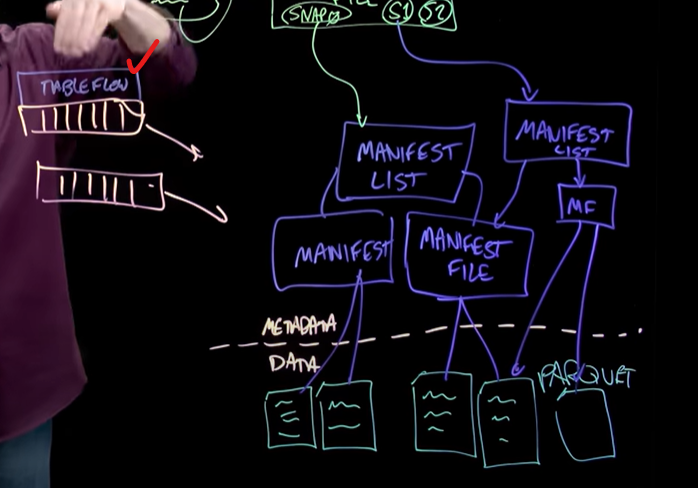

Here’s a **detailed guide notebook** based on the transcript you provided for the video _"The Emergence of Iceberg: A Brief History"_. It’s broken into clear sections with key concepts, diagrams, and real-world relevance to serve as a practical and educational resource.

---

# 🧊 Apache Iceberg: A Comprehensive Guide  
*By Tim Berglund with Confluent | Structured by ChatGPT*

---

## 📌 Table of Contents

1. [Introduction](#introduction)  
2. [The History of Data Systems](#the-history-of-data-systems)  
   - [Data Warehouses](#data-warehouses)  
   - [The Rise of the Data Lake](#the-rise-of-the-data-lake)  
3. [Why Iceberg?](#why-iceberg)  
4. [Iceberg’s Logical Architecture](#icebergs-logical-architecture)  
   - [Data Layer](#1-data-layer)  
   - [Metadata Layer](#2-metadata-layer)  
   - [Snapshot System](#3-snapshot-system)  
   - [Catalog](#4-catalog)  
5. [Iceberg Infrastructure](#iceberg-infrastructure)  
6. [Iceberg in the Streaming World](#iceberg-in-the-streaming-world)  
   - [Tableflow: Kafka Topics as Tables](#tableflow-kafka-topics-as-tables)  
7. [Final Thoughts](#final-thoughts)

---

## 🧭 Introduction

Apache Iceberg is an **open table format** that brings SQL-like, transactional behavior to data lakes, helping organize Parquet files and metadata into coherent, queryable tables.

---

## 📚 The History of Data Systems

### Data Warehouses (1980s–2000s)

- **Purpose:** Aggregate data from many relational databases into a single system.
- **ETL Workflow:** Extract, Transform, Load — a nightly batch process.
- **Advantages:** Queryable, well-modeled schemas.
- **Limitations:** Rigid, not designed for massive scale or real-time data.

---

### The Rise of the Data Lake (~2008 onward)

- **Started with Hadoop**, then shifted to **cloud storage** like AWS S3.
- **New workflow:** ELT (Extract, Load, then Transform).
- **Goal:** Scale + flexibility. Dump data first, figure it out later.
- **Downside:** Lack of schema consistency, no transaction management.

---

## ❓ Why Iceberg?

Over time, limitations in the data lake model appeared:

| Challenge | Iceberg's Solution |
|----------|-------------------|
| ❌ No schema enforcement | ✅ Strong schema evolution support |
| ❌ No consistency/atomic updates | ✅ ACID-like transaction model |
| ❌ Query inefficiency | ✅ Optimized metadata and partition pruning |
| ❌ Lack of support for deletes/upserts | ✅ Full DML support |

🎬 **Iceberg was developed by Netflix** to bring database-like features back to the data lake without losing scale or openness.

---

## 🏗️ Iceberg’s Logical Architecture

> "Let’s build it bottom-up."

---

### **1. Data Layer**

- **Storage:** Usually Parquet files in S3 (or similar).

- **Simple start:** Just drop files in a folder.
- **Limitation:** No structure, no metadata, no way to query or manage reliably.

---

### **2. Metadata Layer**

**Components:**

#### a. Manifest Files
- List of data files (Parquet).
- Includes metadata like:
  - File path
  - Min/max values
  - Column types and stats

#### b. Manifest List
- Points to multiple manifest files.
- Represents an **ingest event** or **table version**.

```plaintext
Manifest List
  ├── Manifest File A
  │     └── Parquet File 1, 2
  └── Manifest File B
        └── Parquet File 3, 4
```

---

### **3. Snapshot System**

#### 📸 Snapshots

- Represents a consistent version of a table at a point in time.
- Each points to a manifest list.
- Stored in the **metadata file**, which:
  - Tracks snapshots
  - Points to the current table state
  - Enables time travel and rollback

#### 🧠 Benefits
- Atomic changes
- Multi-table transaction support
- Schema evolution

---

### **4. Catalog**

- Maps a **table name** (e.g., `thermostats`) to its **metadata file**.
- Can be backed by:
  - Hive Metastore
  - JDBC DBs (e.g., PostgreSQL)
  - Custom implementations (e.g., SQLite)

---

## 🧱 Iceberg Infrastructure

**Is Iceberg a server or database?**
> **No.** It's a **specification** + a set of libraries.

| Component | Implementation |
|----------|----------------|
| Storage | S3, GCS, Azure Blob, HDFS |
| Catalog | Hive Metastore, JDBC, etc. |
| Execution | Spark, Flink, Trino, Presto, etc. |

---

## 🔄 Iceberg in the Streaming World

> “Let’s make stream and table one.”

### Challenge:
Traditional pipeline:
- Stream to Kafka → Batch process → Write to Parquet → Register with Iceberg

### 🎯 Confluent’s Innovation: **Tableflow**

- Treat a **Kafka topic as a live Iceberg table**.
- Automate updates to manifests and snapshots as data flows.
- Integrated with **Schema Registry** and **Confluent Cloud Governance**.

**Outcome:** Real-time, queryable tables without batch dumping.

---

## 🔚 Final Thoughts

Apache Iceberg represents the **modern evolution of data architecture**, merging the best of:

- **Warehouses (structure, transactions)**
- **Lakes (scale, openness)**
- **Streams (real-time ingestion)**

### 🔍 Learn More

- Try Iceberg with Spark or Flink
- Explore Confluent’s [Tableflow](https://www.confluent.io)
- Read the [Iceberg spec](https://iceberg.apache.org/spec/)

---

Let me know if you want this as a downloadable PDF, Markdown file, or Jupyter Notebook format!
