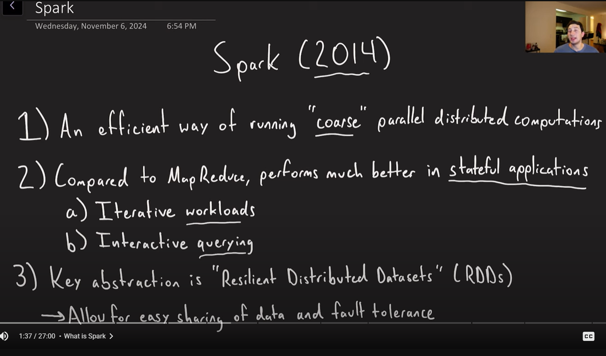
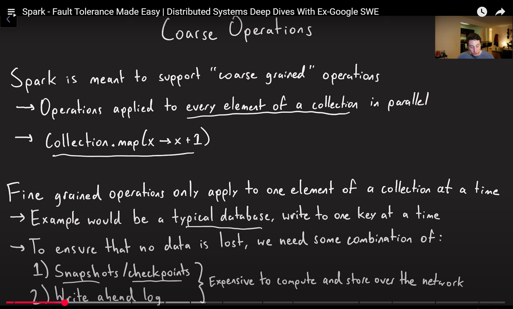
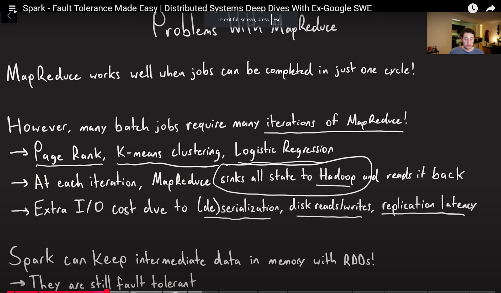
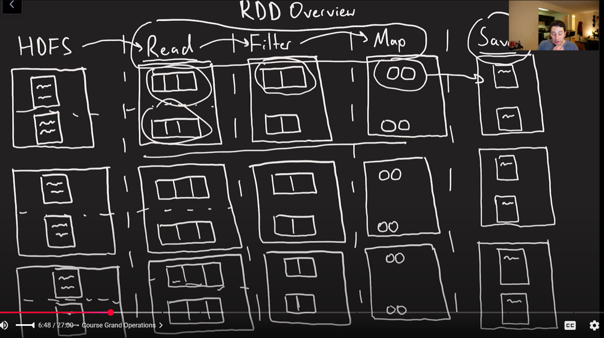
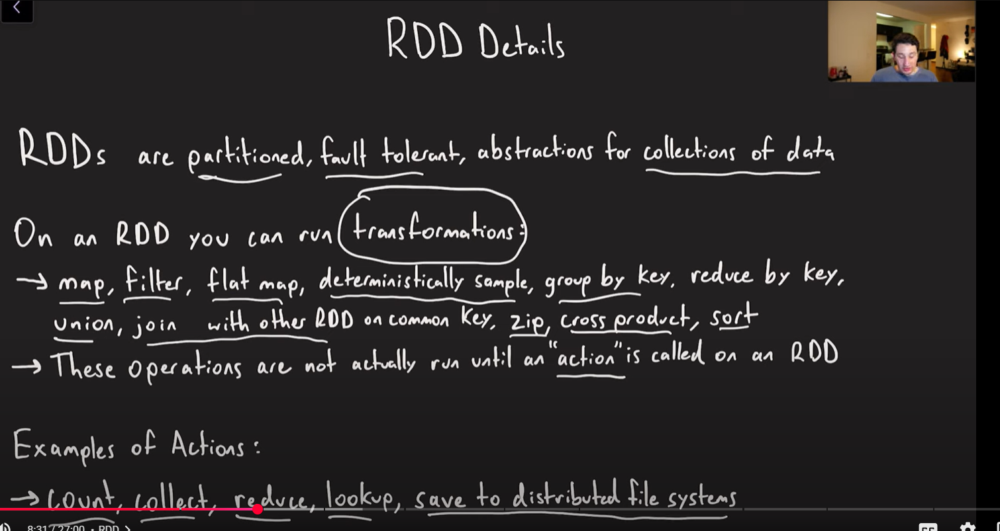
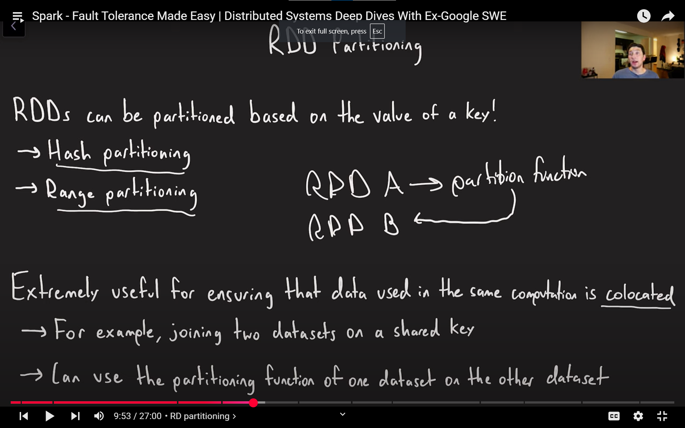
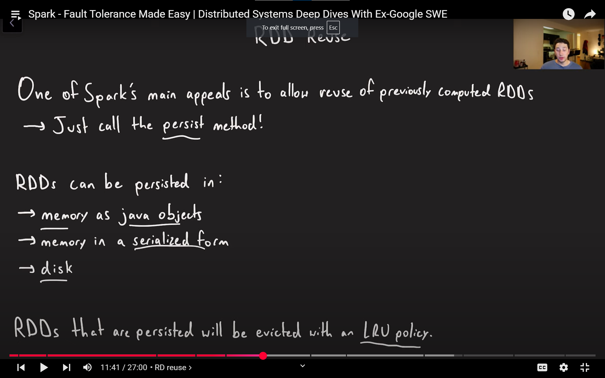
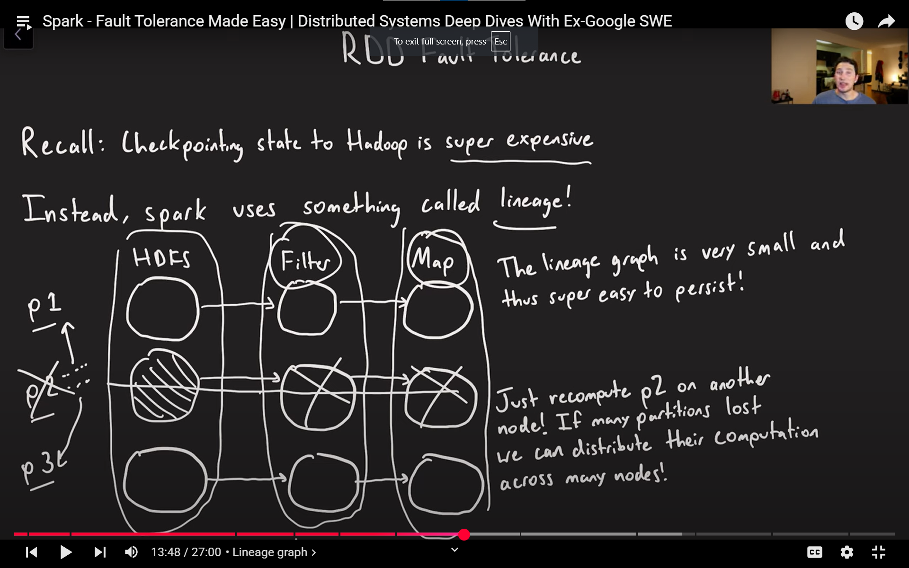
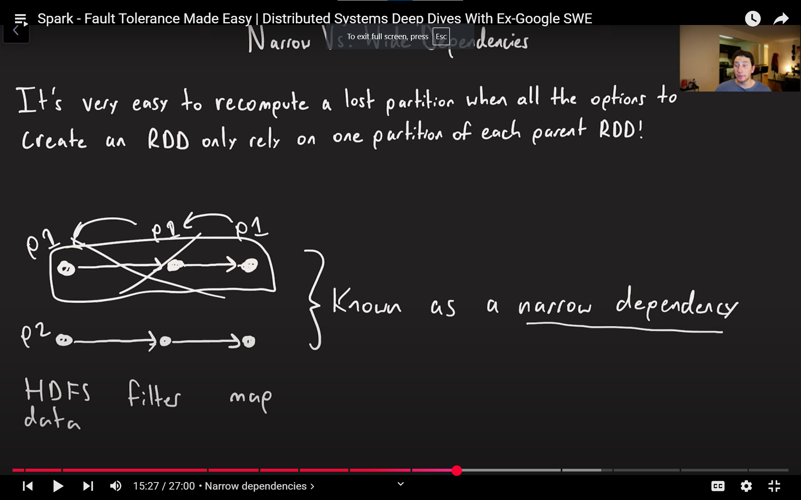
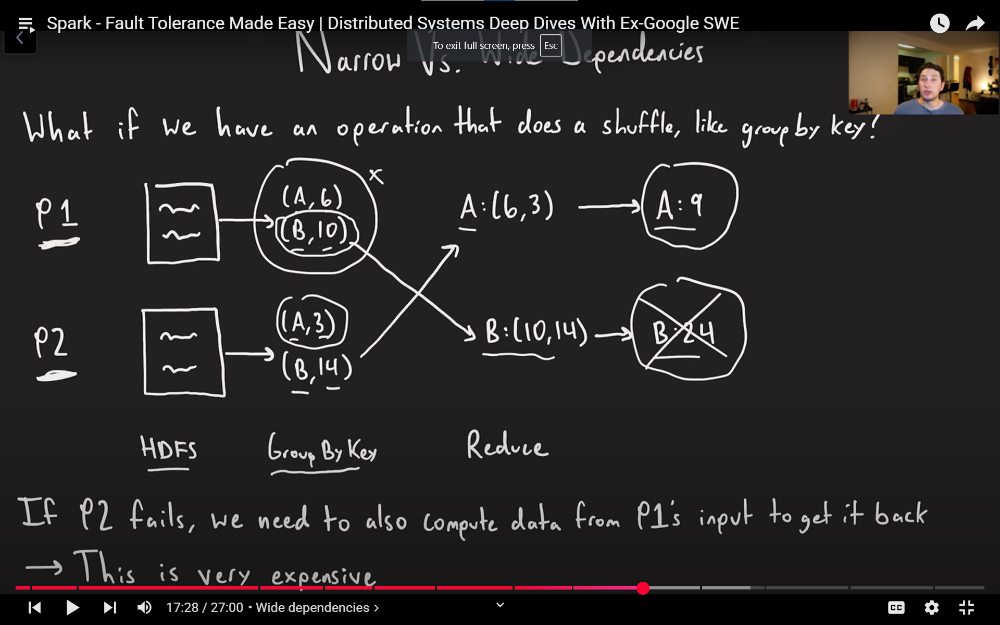

## **Introduction: Narrow and Wide Dependencies in Spark**

- **Introduction to Spark and the paper**: The speaker introduces the topic of Spark and the concepts of "narrow" and "wide" dependencies, jokingly comparing them to personal body functions.
- **What is Spark?**:  
  - **Origin**: Spark is a technology created by UC Berkeley in 2014, which later led to the founding of Databricks.
  - **Purpose**: It is designed for efficient parallel distributed computations.
  - **Comparison to Hadoop**: Spark is often compared to Hadoop, especially focusing on the **MapReduce** component of Hadoop.
  - **Use cases**: It is particularly effective for **stateful applications**, machine learning models, and iterative workloads.

---

## **Key Concepts in Spark: RDDs and Fault Tolerance**
- **RDD (Resilient Distributed Datasets)**:  
  - Spark is built around the abstraction of RDDs. RDDs represent collections of data that can be distributed and manipulated across nodes.
  - **Fault Tolerance**: RDDs provide fault tolerance by ensuring the data can be recomputed if a node fails, rather than relying on extensive persistence.
  - **Efficient for Parallel Workloads**: RDDs help express most parallel computations efficiently and are central to Spark's performance.

---

## **Course-Grain Operations**
- **Definition**:  
  - **Coarse-grain operations** apply the same operation to every element in a collection. Examples: **map**, **filter**, **reduce**. 
  
  - **Contrast to fine-grain operations**: Fine-grain operations are typically individual operations on specific pieces of data, which can be harder to persist and manage, as seen in databases.
- **Challenges in databases**: 
  - In databases, fault tolerance is harder due to fine-grain operations, which require persistent state management like checkpoints or write-ahead logs.

---

## **MapReduce Problems**
- **MapReduce’s Limitations**:  
  - **Overhead due to Persistence**: In MapReduce, at the end of every map and reduce cycle, data must be serialized, written to disk, and replicated (in Hadoop, 3 copies). This introduces significant overhead.
  - **Iterative Algorithms**: Some algorithms, like **PageRank**, **K-means clustering**, and **logistic regression**, require multiple iterations. In MapReduce, these iterative processes face bottlenecks due to disk I/O and replication.

  
  
  - **Example (PageRank)**:  
    - In **PageRank**, each document's score is updated iteratively. In MapReduce, this requires serializing and deserializing data between each iteration, resulting in performance issues.
  
- **How Spark Solves this**:  
  - Spark avoids excessive disk I/O and replication. By keeping data in **memory**, Spark speeds up iterative algorithms significantly.
  - **RDDs and Fault Tolerance**: Fault tolerance in Spark is achieved by storing only the necessary information to recompute data on failure (not by replicating it across nodes).
  
---

## **RDD: Partitioning and Transformations**

- **RDD Basics**:  
  - RDDs are **partitioned** collections of data.
  - Operations on RDDs generate new RDDs. For example:
    - **Read from HDFS**: Data starts in HDFS, partitioned across the system.
    - **Transformations**: Operations like **filter**, **map**, etc., are applied to partitioned data, generating new RDDs.
  
- **Fault Tolerance**:  
  - Spark’s fault tolerance is achieved by tracking the sequence of operations that produced an RDD. If an RDD is lost, it can be recomputed from its dependencies, not by storing a full replica.
  
---

## **Transformations on RDDs**
- **Transformations**:  

  These operations transform one RDD into another. All transformations are **lazy**, meaning they do not execute immediately but instead create a plan for computation.
  - **Examples of Transformations**:
    - **map**: Apply a function to every element.
    - **filter**: Keep elements that satisfy a condition.
    - **flatMap**: Transform each input element into zero or more output elements.
    - **groupByKey**: Group data by key.
    - **reduceByKey**: Aggregate values by key.
    - **union**: Combine two RDDs.
    - **join**: Combine two RDDs on a common key.
    - **zip**: Combine two RDDs element-wise.
    - **cross**: Perform a cross product between two RDDs.
    - **sort**: Sort elements.

- **Actions in Spark**:
  Actions are operations that trigger the execution of transformations, returning actual results.
  - **Examples of Actions**:
    - **count**: Count the number of elements in an RDD.
    - **collect**: Return all elements as a list to the driver.
    - **reduce**: Combine elements using a function.
    - **lookup**: Retrieve elements based on a key.
    - **save**: Store data back to a distributed file system (e.g., HDFS).

---

## **Lazy Evaluation in Spark**
- **Lazy Evaluation**:  
  - Spark only computes the data when an **action** (like **count**, **collect**, or **save**) is triggered. This allows Spark to optimize the execution plan by combining transformations into fewer stages.
  
---

## **Conclusion**
- **Advantages of Spark over MapReduce**:  
  - Spark optimizes iterative processing (such as in machine learning) by keeping data in memory and reducing unnecessary persistence.
  - RDDs provide efficient parallel computations with fault tolerance, reducing overhead compared to MapReduce’s heavy reliance on disk I/O and replication.

---

These notes provide a deep dive into Spark's architecture, focusing on RDDs, their role in fault tolerance, and how Spark optimizes distributed computation compared to traditional MapReduce-based systems.

Here’s a detailed and structured set of notes compiled from the provided transcript, covering **RDD Partitioning**, **RDD Reuse**, **Lineage Graph**, **Narrow Dependencies**, and **Wide Dependencies** in Apache Spark:

---

### 🔹 **RDD Partitioning**

- **Purpose:** 
  - Important for *data locality* and performance in distributed computations.
  - Enables more efficient joins and batch operations by reducing data movement across the network.

- **Types of Partitioning:**
  1. **Hash Partitioning:**
     - Generally provides a *uniform distribution* of data.
     - Good when keys are randomly distributed.
  2. **Range Partitioning:**
     - Useful for *locality-sensitive* operations.
     - Keeps records with nearby keys together.
     - Beneficial for range queries or ordered processing.

- **Data Collocation:**
  - If two datasets are partitioned the same way (e.g., by the same partition function), a *join* operation on those datasets requires significantly *less network shuffling*.

- **How to Share Partition Functions:**
  - You can extract the partition function from RDD **A**, and apply it to RDD **B** to ensure aligned partitioning.
  - This alignment helps reduce network costs during joins or other multi-RDD operations.

---

### 🔹 **RDD Reuse**

- **Comparison to MapReduce:**
  - In MapReduce, intermediate state must be persisted to disk, adding overhead.
  - Spark allows *in-memory persistence*, enabling *efficient reuse* of RDDs across multiple computations.

- **Persisting an RDD:**
  - Use `.persist()` method to store an RDD in memory.
  - Spark keeps it in memory using an **LRU (Least Recently Used)** policy.
  - Helps for *interactive queries* or iterative machine learning workloads.

- **Storage Trade-offs:**
  1. **In-Memory Java Objects:**
     - Fast access but consumes RAM.
  2. **Serialized In-Memory Storage:**
     - Saves space but slower due to (de)serialization overhead.
  3. **Disk Storage:**
     - More storage space available but significantly slower access.
  - Spark may **spill to disk** when memory is full.

---

### 🔹 **Lineage Graph: Fault Tolerance Mechanism**

- **Lineage vs. Checkpointing:**
  - Traditional systems like Hadoop use **checkpointing**, which is costly.
  - Spark avoids this by using **lineage graphs** for *lazy fault recovery*.

- **What is a Lineage Graph?**
  - A *directed acyclic graph (DAG)* showing how an RDD is derived from other RDDs.
  - Stores the sequence of transformations (e.g., map, filter) needed to recompute data.

- **Recovery via Lineage:**
  - If a partition (e.g., P2) is lost, Spark:
    1. Refers to the lineage graph.
    2. Recomputes only that partition by replaying necessary operations from source data.
    3. Distributes this recomputation across available workers.

- **Efficiency:**
  - The lineage graph is **compact (a few KBs)** and avoids full replication.
  - Enables faster, *on-demand recomputation* without checkpointing every transformation.

---

### 🔹 **Narrow Dependencies**

- **Definition:**
  - Each partition in the child RDD depends on *only one* partition in the parent RDD.
  - Examples: `map`, `filter`, `union`, etc.

- **Benefits:**
  - Easy to *parallelize recomputation* in case of partition loss.
  - Lost data can be recomputed by reapplying transformations to the parent partition.
  - Suitable for fault-tolerance via lineage.

- **Example Scenario:**
  - Partition `P1` in RDD-A → transformed to Partition `P1` in RDD-B.
  - Failure of `P1` in RDD-B can be recovered *locally* without touching other partitions.

---

### 🔹 **Wide Dependencies**

- **Definition:**
  - Each partition in the child RDD depends on *multiple* partitions from the parent RDD.
  - Typically results in a **shuffle** (network transfer).
  - Examples: `groupByKey`, `reduceByKey`, `join`.

- **Challenges:**
  - Recomputing data becomes expensive if a node fails because:
    - It requires *re-accessing and reshuffling* all contributing parent partitions.
    - Data isn't easily localized; may involve many-to-one mappings.

- **Example - `groupByKey`:**
  - Partitions with key-value pairs get split by key across different nodes.
  - If a node holding key `B` fails, we need to recompute *all data with key B* by:
    - Going back to the original source RDDs (e.g., from HDFS).
    - Re-running the entire pipeline (shuffle included).

- **Solution: Checkpointing**
  - After wide dependency operations, **checkpoint the output**.
  - Converts the output into a **new narrow dependency**, making future recomputations easier.
  - Avoids repeating the expensive shuffle.

- **Why This Works:**
  - Because RDDs are **immutable**, checkpointing them is easy and contention-free.
  - No locking or consistency issues arise.

