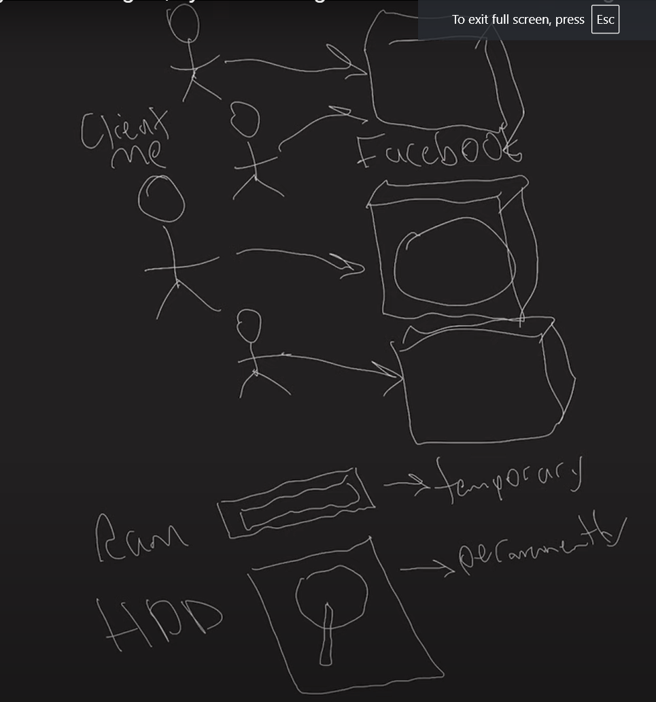
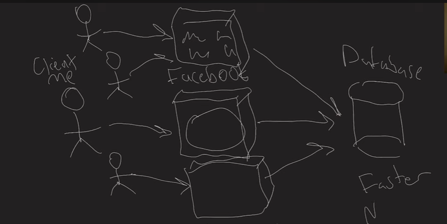
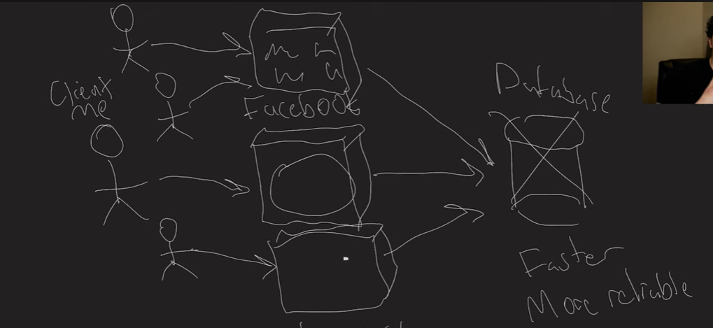

### **Guide to Systems Design: Refactoring and the Basics of Data Storage**

---

### **1. Introduction to Systems Design**
Systems design is a critical part of software engineering interviews, particularly in large-scale tech companies like Google. In this video series, Jordan, a Google software engineer, introduces his refactored systems design interview series with a focus on providing rich, visual content to aid in understanding the key concepts of system design. The main goal is to offer content that can rival paid courses but is completely free and highly accessible.

This guide will cover the basics of systems design from the ground up, including the core considerations of how data is stored and accessed across multiple servers and clients.

---

### **2. What is Systems Design?**
In the context of a systems design interview, you are typically asked to design a system that can handle a large amount of data or traffic. You’ll often be given a use case where you need to think about scaling, storing data efficiently, ensuring reliability, and handling millions of user requests simultaneously.

#### **Example Use Case: A Social Media Website (e.g., Facebook)**
- **Problem Framing**: Imagine you're working on a social media platform like Facebook. The system needs to handle tons of user requests, such as fetching user profiles, images, posts, and more. One key challenge is deciding how to store and retrieve all this data efficiently and at scale.
  
---

### **3. The Role of Clients and Servers**
- **Client**: A client is any device (like a phone or computer) that interacts with the system by sending requests to servers. In this case, a client might request to see a Facebook user profile.
- **Server**: Servers are machines that handle requests from clients and serve responses. The Facebook application server is an example of such a server. However, a single server will not be enough to handle the massive scale of requests from millions of users.

---

### **4. Where to Store the Data?**
- **RAM vs. Hard Drive**: When discussing data storage, there are two primary types of storage in computers:
  - **RAM (Random Access Memory)**: Used for temporary, quick access to data. This is where computations and active processes occur. However, data in RAM is lost when the computer shuts down.
  - **Hard Drive (HDD)**: Used for permanent storage. It stores data even if the machine is powered down.

In a real-world scenario, for a company like Facebook, storing data directly on the application servers (which can shut down anytime) would not be ideal. Instead, they would store it on hard drives to ensure persistence and durability.

---

### **5. Challenges with Scaling**
One server handling all requests is not enough when dealing with large-scale systems. As the number of users grows, so do the demands on the servers. The challenge is to design a scalable system where multiple servers work together to handle data requests.

- **Application Server Bottleneck**: The application servers become a bottleneck when they handle all user requests simultaneously. Instead, the data itself should be stored and managed separately from the application servers to avoid performance issues.

---

### **6. Introducing Databases**
- **Database as the Source of Truth**: Instead of storing all data on application servers, we use a **database** to store data like user profiles, posts, images, etc. The database acts as the single source of truth.
  
- **Database Role**: The database is primarily responsible for storing data persistently. It interacts with application servers whenever data needs to be accessed or modified. However, even a single database might not be sufficient due to scalability limitations.

---

### **7. Scaling the Database**
When dealing with massive amounts of data, even one database might not be enough to handle the load. Several strategies are used to scale databases:
- **Database Sharding**: This involves splitting data into smaller, manageable chunks (shards) across multiple databases or servers. This helps ensure that no single database becomes overwhelmed.
  
- **Fault Tolerance**: The system must be designed with fault tolerance in mind. If one database server fails, backup systems or replicas should be in place to ensure data isn't lost, and users can still access the data they need.

---

### **8. Further Considerations for Scalability and Reliability**
To make the system faster, more reliable, and more scalable, additional techniques come into play:
- **Caching**: Frequently accessed data can be stored temporarily in a cache. This reduces the load on the database and improves response times.
- **Redundancy**: Having multiple copies of data ensures that if one server goes down, there’s always another available.
  
---

### **9. Learning Approach**
Jordan emphasizes starting from the **database layer** and then moving outward to other components like application servers and caching mechanisms. This inside-out approach helps tackle the complexities of systems design incrementally, ensuring a solid understanding of the core building blocks before moving to more advanced concepts.

---

### **10. Key Takeaways**
1. **Systems Design** focuses on how to design systems that can scale efficiently while ensuring data is stored and retrieved reliably.
2. **Client-Server Interaction**: Clients request data, and servers respond with the data. However, direct storage on application servers isn't scalable.
3. **Data Storage**: Use hard drives (HDDs) for permanent data storage, with RAM for temporary computations.
4. **Databases** serve as the primary place for storing persistent data and must be designed to handle high traffic and provide fault tolerance.
5. **Scalability**: Multiple servers and databases (via sharding) are necessary to handle large-scale user interactions.
6. **Fault Tolerance**: Always have backup systems or replicas to ensure data isn’t lost and services remain available during server failures.

---

### **11. What's Next?**
This introduction is just the beginning. In the next videos, Jordan plans to dive deeper into advanced systems design concepts like **caching**, **load balancing**, **distributed systems**, and other techniques that improve the performance and reliability of large-scale systems.

Jordan also stresses the importance of learning by teaching—both for himself and his audience. So, as we go through this series, expect to learn a lot about systems design in a digestible and structured manner.

--- 

### **Conclusion**
This guide covers the foundational concepts of systems design, focusing on data storage and management, which are core to the performance of large-scale systems. Whether you're new to systems design or looking to refine your knowledge, this content will serve as a helpful resource in your learning journey.