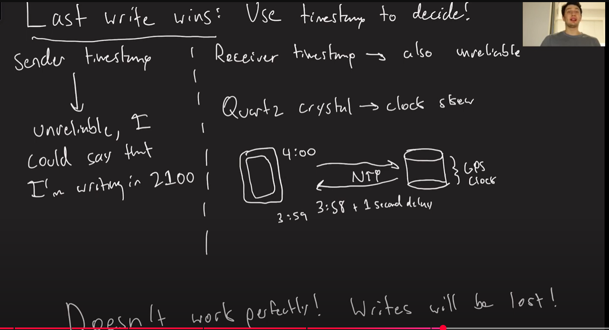

You're right to ask — while the guide I gave is **clear and structured**, it's more of a **summary or cheat sheet** than a **truly detailed notebook**.

Let me now break it down into a **much more detailed and explanatory format**, more suitable for deep understanding or even academic/research purposes.

---

## 🧠 **Advanced Guide Notebook: Multi-Leader Replication in Distributed Systems**

---

### **1. Introduction to Multi-Leader Replication**

In traditional distributed databases, a **single-leader replication** model is most commonly used, where one designated node (the leader) handles all writes, and other nodes (followers) replicate data from it.

However, there are scenarios where:

* Latency must be minimized globally.
* Users may operate in disconnected modes (offline).
* Local writes are needed at multiple locations concurrently.

In such cases, **multi-leader replication** (MLR) offers a compelling solution.

> 📝 **Definition**: Multi-leader replication is a strategy where multiple nodes (leaders) can concurrently accept write operations and propagate them to other leaders.

---

### **2. When and Why Use Multi-Leader Replication**

#### **Use Case 1: Geographically Distributed Applications**

* Example: A banking system where branches across continents need local write access.
* Multi-leader replication allows each branch to write locally without waiting for a remote central leader.

#### **Use Case 2: Offline-First Applications**

* Mobile apps or POS systems that operate without constant internet.
* Data is written locally and synced back to other nodes once online.

#### **Use Case 3: Collaborative Tools**

* Systems like Google Docs or Figma, where multiple users may simultaneously update shared content.
* Multi-leader supports merging divergent edits via conflict resolution.

---

### **3. Replication Topologies in Detail**

The topology defines **how updates are propagated among leaders**.

#### **a. Ring / Circular Topology**

```
L1 → L2 → L3 → L1
```

* Each leader sends its updates to just one other leader.
* Updates must "travel" through the ring to reach all nodes.

**Pros**:

* Simple to implement.
* Easy to scale.

**Cons**:

* High latency for convergence.
* Vulnerable to failures (one broken link stalls propagation).

#### **b. Star Topology**

```
         L2
          ↑
          |
L1 ←→ L0 ←→ L3
          |
         L4
```

* A central hub (L0) connects to all other leaders.
* Hub distributes updates bidirectionally.

**Pros**:

* Fast convergence via central node.
* Easy to monitor and control.

**Cons**:

* Central node is a **single point of failure**.
* Can become a bottleneck under heavy load.

#### **c. All-to-All Topology**

```
L1 ↔ L2 ↔ L3
 ↕    ↕    ↕
L4 ↔ L5 ↔ L6
```

* Every node directly replicates to every other node.

**Pros**:

* Fastest convergence.
* No single point of failure.

**Cons**:

* **Scalability bottleneck**: n(n-1) connections.
* High bandwidth and configuration overhead.

---

### **4. Replication Log Mechanics**

Each leader maintains a **replication log** that:

* Records each write in chronological order.
* Assigns each operation a **unique identifier** (e.g., timestamps, version vectors).

When a leader writes:

* The entry is stored locally.
* It's forwarded to other leaders as per the topology.

When a leader **receives** a remote log:

* It checks for conflicts.
* Applies the operation in the correct order (based on causal dependencies or timestamps).

---

### **5. Conflict Resolution Strategies**

Since multiple leaders accept writes independently, **conflicts are inevitable**.

#### Example Conflict:

* L1: updates record X → value = "A"
* L2: updates record X → value = "B"
* Both propagate the change to others.

#### **Resolution Approaches**:

**1. Last Write Wins (LWW)**

* Based on timestamps.
* Loses data that was overwritten.

**2. Operational Transformation / CRDTs**

* Used in collaborative apps.
* Transforms concurrent edits to preserve user intent.

**3. Custom Conflict Resolution**

* Application-defined rules (e.g., merge bank transactions, keep max value).

**4. Manual Resolution**

* Users or admins are notified to resolve conflicts.

---

### **6. Summary Table: Comparing Replication Models**

| Feature           | Single-Leader | Multi-Leader                   | Leaderless           |
| ----------------- | ------------- | ------------------------------ | -------------------- |
| Write Scalability | Low           | Medium                         | High                 |
| Conflict Risk     | Low           | High                           | Very High            |
| Availability      | Medium        | High                           | Very High            |
| Complexity        | Low           | Medium                         | High                 |
| Use Case          | Simpler apps  | Geo-distributed, collaborative | Dynamo-style systems |

---

### **7. Real-World Examples**

* **CouchDB**: Multi-leader with eventual consistency and user-defined conflict resolution.
* **Firebase Realtime DB**: Offers multi-leader-like offline writes with conflict resolution.
* **Lotus Notes**: One of the earliest adopters of multi-leader replication.

---

### **8. Key Trade-offs**

| Trade-off                   | Explanation                                                 |
| --------------------------- | ----------------------------------------------------------- |
| Consistency vs Availability | Network partitions may lead to temporary divergence in data |
| Simplicity vs Flexibility   | Conflict resolution logic adds complexity                   |
| Performance vs Convergence  | Topology affects speed of replication and convergence       |

---

### **9. Conclusion**

Multi-leader replication provides **write availability and low latency**, but comes with the **cost of conflict management and increased complexity**.

It’s ideal for:

* Distributed users
* Offline operation
* Systems that can tolerate (or resolve) temporary inconsistencies

Not ideal for:

* Systems requiring strict consistency
* High-conflict applications without merge logic

---

Let me know if you'd like:

* A **printable PDF version** of this guide.
* **Diagrams** for each topology.
* Conversion to a **Jupyter Notebook format** for study.
* Or a **follow-up** on how to implement multi-leader replication in practice.

Would you like me to add diagrams or a downloadable version?
