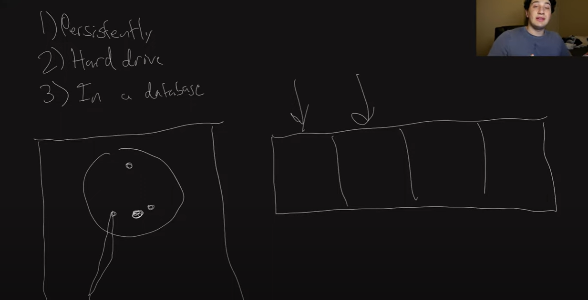
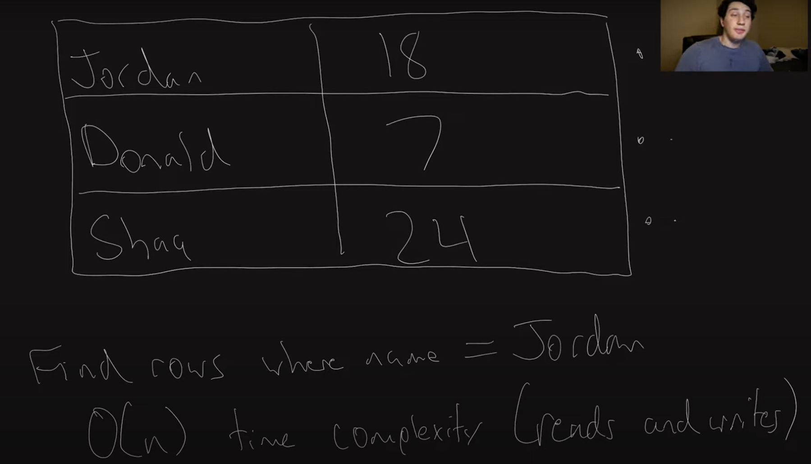
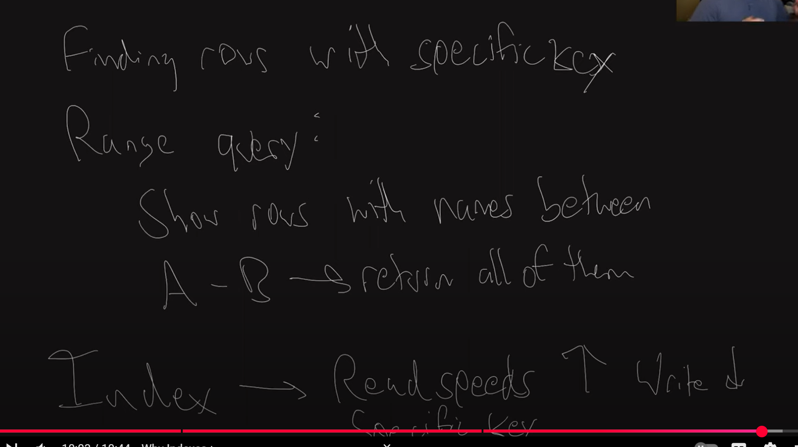

Here are the key concepts discussed in the transcript:

### 1. **Data Persistence and Storage**
   - **Persistent Data Storage**: The data must be stored in a way that is durable across system reboots, which is why a **hard drive** is preferred over **RAM**. RAM doesn't store data when a computer shuts down, whereas hard drives do.
   - **Hard Drives**: Data is stored on a hard drive using a **moving arm** that positions itself on a metallic disc to read or write data. The closer data is located on the disk, the faster it can be accessed since the arm doesn’t need to travel far.

### 2. **Data Organization and Access**
   - **Sequential Data Access**: If data is scattered on the disk, the read/write process becomes slower as the arm has to move more to access distant data. For better performance, it’s important to store related data physically close to each other on the disk.
   - **Time Complexity**: When searching for a specific row in a database, the time complexity can be **O(n)**, meaning the time it takes increases linearly with the number of rows. Similarly, writing data also takes **O(n)** time to find the correct row to modify.

### 3. **Database Table Example**
   - The transcript uses a simple database table storing **names** and **shoe sizes**. It illustrates the idea of finding a specific row (e.g., by name) and modifying data (e.g., changing shoe size).
   - **Inefficiency in Basic Database**: In a simple table, searching and editing rows takes **O(n)** time, which can become inefficient with large datasets.
   
    
### 4. **Optimizing Database Writes**
   - A better approach to database writes is to avoid modifying existing rows directly. Instead, you add new rows at the end of the table (for example, when updating someone's shoe size).
   - This method leads to **O(1)** time complexity for writes since new data is always appended to the end, and searching is done from the bottom of the table for recent updates.
   - However, this method can **increase read time** because there are more rows to scan when performing a search.

### 5. **Performance Trade-offs**
   - **Write Efficiency (O(1) writes)**: Appending new data to the bottom of the table is faster but results in more rows, making reading slower.
   - **Read Efficiency (O(n) reads)**: Searching through the entire table becomes slower because more rows exist.
   - The overall trade-off is that for websites that prioritize **read speed** (e.g., social media platforms), this approach can be acceptable even if it makes writing more expensive.

### 6. **Need for Indexing**
   - **Indexes** help optimize **read** operations by creating a more efficient way to find rows based on certain key values (like names or shoe sizes) without scanning the entire table.
   - **Range Queries**: Indexes are especially useful for operations like **range queries**, where you want to find rows that fall within a specific range, such as names between A and B or posts from a certain time period.
   - Indexes are commonly used when reads are far more frequent than writes, as they can improve read performance at the cost of slowing down writes.
   
### 7. **Database Indexes: Trade-offs**
   - **Indexing**: An index improves read speeds but introduces a penalty on write speeds, as every new row insertion or update must update the index as well.
   - Indexes can be created on **one field** (like name), or multiple fields (like name and shoe size).
   - In future videos, the speaker plans to explain **hash indexes** as one implementation of an index.

### 8. **Wrap-up**
   - The speaker humorously mentions the challenges of the technical recording and thanks viewers for their support.
   - A follow-up video will demonstrate the implementation of a **hash index** and explore its benefits and pitfalls.

These concepts are centered around database performance, specifically how to efficiently store, access, and update data with a focus on balancing read and write efficiency through methods like indexing.

The transcript provided is a detailed explanation of a series on database optimization, specifically focusing on how data is stored on disk and how to improve read and write performance. Below is a detailed breakdown of the transcript:

### **Key Takeaways from the Transcript**

1. **Persistence of Data**: Data needs to be stored persistently on a hard drive rather than in volatile RAM.
2. **Hard Drive Mechanics**: The placement of data on the hard drive affects read and write speeds, with data closer together being more efficient.
3. **Challenges of Searching and Editing Data**: Basic database operations like searching and editing data in a table can take O(n) time, which is inefficient for large datasets.
4. **Improved Write Strategy**: Instead of editing data, new rows are added, and a pointer is maintained for efficient writes. This improves write performance but worsens read performance.
5. **The Need for Indexes**: To improve read performance, indexes are essential. They help with quick lookups and range queries but introduce a trade-off by slowing down writes.
6. **Index Benefits and Trade-offs**: Using indexes makes reading faster but writing slower, which is acceptable in read-heavy applications like social media sites.
7. **Next Steps**: The next video will focus on the implementation and nuances of hash indexes, which are a common type of database index.