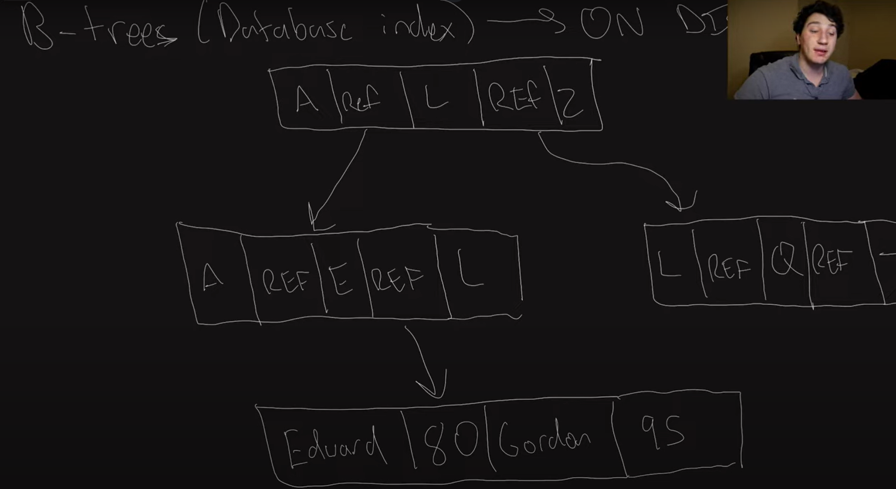
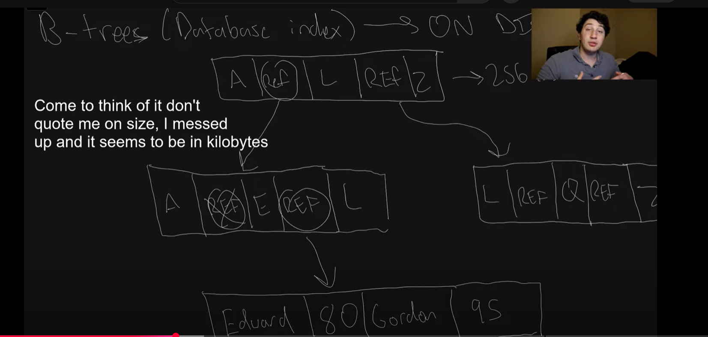
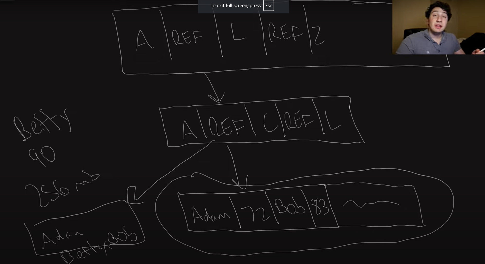

### B-Tree Detailed Breakdown

---

#### **Intro:**
- **Host’s Personal Announcement:**
  - Apologizes for nasally voice due to illness from a busy weekend.
  - Shoutout to a viewer, **Ty**, who reached out on LinkedIn to share he received four senior offers after studying the content of the channel.

#### **What is a B-Tree:**

- **General Definition:**
  - A **B-tree** is a type of **database index** used for efficient data retrieval and storage.
  - Compared to **hash maps** (which store data in memory), a **B-tree** is stored entirely on disk, offering benefits like better scalability and durability.

- **Structure of a B-Tree:**
  - A tree-like data structure, where nodes contain:
    - **Range of keys** (usually sorted).
    - **References** to other disk locations (which may contain further nodes or actual data).
  - Traversing the tree involves following references to locate the desired data.
  
- **Example Explanation:**
  - For a dataset of **names and scores** (e.g., students' scores), the **B-tree** might represent the data as follows:
    - The first node contains references to the next nodes or leaves for ranges like **A-E**, **F-O**, etc.
    - The leaf nodes contain the actual data (e.g., “Edward: 80, Gordon: 95”).

#### **Key Benefits:**

1. **Efficient Reads:**
   - Traversing the tree is efficient for reads because it only requires a few steps (referred to as **traversals**) to reach the target data.
   - The **tree remains balanced**, which ensures a constant height, contributing to consistent read performance.
   
2. **Efficient Disk Usage:**
    
   - Pages within the tree are typically large (e.g., **256 MB**), allowing the tree to hold many keys while remaining relatively short in height.
   - Fewer disk accesses are required since the tree stays compact and balanced.

3. **Efficiency of Updates:**
   - For updates, the key is located, and the data is updated directly or inserted at the appropriate location.
   - **Updates** happen by traversing the tree, finding the correct key, and either updating or adding it.

#### **Write Operations and Challenges:**

- **Write Operation Process:**
    
  - **Adding a new key (e.g., "Betty: 90")** involves:
    1. **Finding the correct leaf node** for the key.
    2. If space is available in the node, the key is inserted and the node is updated.
    3. If no space is available, the node **splits** into two nodes. The parent node must be updated accordingly.
    4. If the parent node doesn’t have enough space, it too is split, and this process continues upward.
    5. If the root node splits, a new root is created.

- **Tree Splits and Rebalancing:**
  - Each node has a predefined **page size** (e.g., **256 MB**). If a node overflows, it splits into two nodes.
  - As the split moves upwards, **higher-level nodes** may also split, maintaining the balance of the tree.
  
- **Risk of Inconsistency During Writes:**
  - If a write operation is interrupted (e.g., power failure), the tree may end up in an **inconsistent state** because the node references may not be properly updated.
  - To address this, a **write-ahead log** is used to record operations before they are executed, ensuring recovery in case of failures.

#### **Write-Ahead Log (WAL):**
  - The **write-ahead log** ensures that all updates to the B-tree are recorded before actually writing to the tree. This allows the tree to be restored to a consistent state after a crash or failure.
    
    

#### **B-Tree vs. Hash Indexes:**

- **Performance Comparison:**
  - **B-Tree:** Generally slower than **hash indexes** because the data is stored on disk and disk accesses are slower than memory accesses.
  - **Hash Indexes:** More efficient for lookups since they are in-memory structures.
  - However, **B-trees** excel in situations where the dataset is too large to fit into memory and when **range queries** are required.

- **Advantages of B-Trees:**
  1. **No Memory Constraints:** Unlike hash indexes, not all keys need to fit in memory. A B-tree can handle much larger datasets.
  2. **Range Queries Support:** B-trees are optimized for **range queries** (finding keys in a certain range). Keys stored in adjacent leaf nodes allow efficient sequential reads.
  
- **Why B-Trees are Good for Range Queries:**
  - Adjacent keys in the B-tree are stored in **consecutive nodes**. This makes it easier to fetch all keys in a specified range (e.g., from **E to L**) by traversing fewer nodes.

#### **Summary of B-Tree Characteristics:**

- **Key Features of B-Trees:**
  1. **Self-Balancing Tree:** Ensures the tree remains balanced even after frequent insertions and deletions.
  2. **Disk-Based Storage:** Unlike in-memory hash indexes, the B-tree is optimized for disk-based storage.
  3. **Supports Range Queries:** Adjacent keys are stored together, enabling efficient retrieval of data in specific ranges.

- **Limitations:**
  - Writes are not as fast as reads due to the need to **split nodes** and **rebalance** the tree.
  - **Write-ahead logs** add overhead, but they ensure data consistency and recovery in case of failure.

---

#### **Conclusion:**
- **B-trees** are effective for applications where data needs to be stored on disk, especially for large datasets and range queries.
- The **write performance** may not be as fast as in-memory solutions (like hash indexes), but B-trees provide key advantages in scalability and range query support.
- Future topics may discuss alternative indexing methods that aim to improve write speeds while maintaining B-tree's read performance and range query capabilities.

---

This detailed explanation of B-Trees provides an in-depth look into their structure, use cases, advantages, and challenges, especially in comparison to other indexing methods like hash indexes.