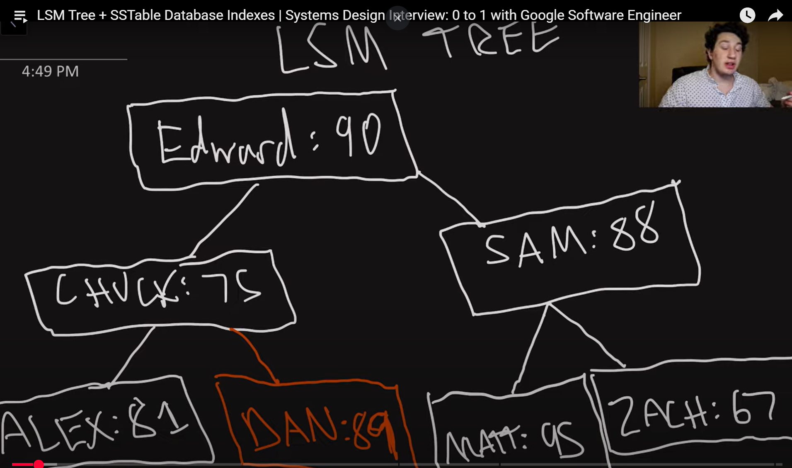

---

# 📘 LSM Trees & SSTables - Study Guide

---

## 📌 Introduction
- **Format Change:** The creator now pre-draws diagrams on the iPad to save time and improve visual quality.
- **Topic:** Covers **Log-Structured Merge Trees (LSM Trees)** and **Sorted String Tables (SSTables)** — a more modern database indexing method compared to B-Trees.

---

## 🌳 LSM Tree: In-Memory Structure

### 🔹 Basics
- LSM Tree is a **write-optimized** index.
- Initially uses an **in-memory balanced binary search tree**:
  - Could be Red-Black, AVL, or B-Tree.
- All keys in this structure follow standard BST properties: Left = smaller, Right = larger.

### 🔹 Operations
- **Reads/Writes** are `O(log n)` due to the balanced tree structure.
- Memory is **fast**, but **not durable** (data loss on crash).

---

## 💾 Durability: Write-Ahead Log (WAL)

- All writes are **first recorded in a WAL** on **disk**.
- WAL is **sequentially written**, which makes disk writes fast.
- In the event of a crash, the LSM tree can be rebuilt by **replaying the WAL**.

---

## 💽 Moving to Disk: SSTables

### 🔹 Problem

- Memory has limited space; the tree can't grow indefinitely.

### 🔹 Solution: SSTable Conversion
- When memory tree exceeds size threshold:
  1. It is **flushed** (cleared).
  2. Converted into a **Sorted String Table (SSTable)** on disk.

### 🔹 SSTable Properties
- **Immutable** (never modified after being written).
- **Sorted**, so binary search is possible.
- Created via **in-order traversal** (linear time `O(n)`).

---

## 📚 Multi-Level Storage

### 🔹 Hierarchical Storage

- Active writes go to the **in-memory LSM tree**.
- Older data exists in **multiple SSTable files** on disk.

### 🔹 Reads
1. Check in-memory LSM tree.
2. If not found, check SSTables **in reverse chronological order**.
   - Newer SSTable has **more recent value** for duplicates.

---

## ❌ Deletion: Tombstones
- No in-place deletion in SSTables.
- To "delete":
  - Insert a **tombstone** marker (a special "deleted" value).
  - Later SSTables will indicate the key has been deleted.

---

## ⏱️ Query Optimizations

### 🔹 Sparse Index

- A partial index over the SSTable (e.g., every 100th key).
- Allows **faster binary search** by narrowing the range.

### 🔹 Bloom Filter
- A **probabilistic data structure**.
- Fast way to check if a **key is *definitely not* in an SSTable**.
- If Bloom Filter returns "maybe," the SSTable is searched.
- Helps **avoid unnecessary disk reads**.

---

## 🧹 Compaction

### 🔹 Why Needed
- **Duplicates and tombstones** accumulate over time.
- Wastes disk space and slows reads.

### 🔹 What It Does
- Merges multiple SSTables into a **new, compacted SSTable**.
- Keeps only the **most recent version** of each key.
- Deletes keys with tombstones.

### 🔹 How It Works
- Like merging two sorted lists.
- Time complexity: `O(n)`

---

## 📊 Performance Trade-Offs

| Feature        | Hash Index         | B-Tree             | LSM Tree          |
|----------------|--------------------|---------------------|--------------------|
| **Speed**      | O(1) in-memory     | Slower writes       | Faster writes than B-Tree |
| **Durability** | Needs WAL          | Writes to disk      | Needs WAL          |
| **Range Queries** | ❌ Not supported | ✅ Supported        | ✅ Supported (slower) |
| **Memory Use** | Keys must fit RAM | Disk-based          | Memory + Disk      |
| **Write Cost** | Fast               | High (direct to disk) | Medium (in-memory + WAL) |
| **Read Cost**  | Fast               | Single read         | Multiple SSTable reads |
| **Compaction** | ❌ Not needed      | ❌ Not needed        | ✅ Needed regularly |

---

## 📝 Summary

- **Hash Index** = Fastest for individual keys, but no range queries and limited by RAM.
- **B-Tree** = Great for **range queries**, used in **relational databases**, slower writes.
- **LSM Tree** = Best for write-heavy workloads, scales well with disk usage, supports range queries but needs **compaction** and **optimization** to keep reads efficient.

---

## 🎓 Key Concepts To Know

- **LSM Tree**: Write-optimized, hierarchical indexing structure.
- **SSTable**: Immutable, sorted table of key-value pairs stored on disk.
- **Write-Ahead Log (WAL)**: Ensures durability.
- **Tombstone**: Marker to indicate a deleted key.
- **Compaction**: Merge + clean up of SSTables.
- **Sparse Index**: Partial index for faster SSTable reads.
- **Bloom Filter**: Probabilistic filter for "definitely not here" checks.

---

## 🧠 Practice Suggestions

- Review BST, Red-Black Trees, AVL Trees.
- Understand `in-order traversal`.
- Implement a **basic compaction routine** (merging sorted arrays).
- Try questions on LeetCode that involve:
  - Sorted list merging
  - Bloom filters
  - In-memory indexing

---
